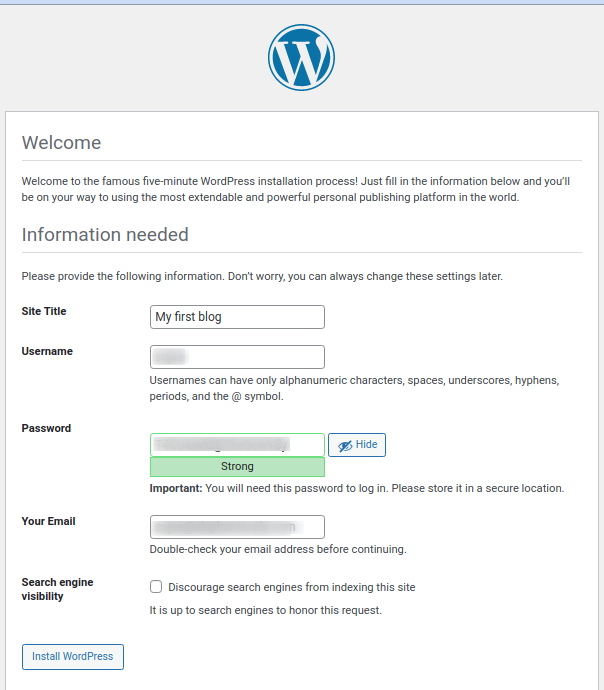

<link rel='stylesheet' href='../../assets/css/main.css'/>

# Lab: Docker Compose  - Wordpress

## Overview

We will launch a wordpress site with mysql as database

## Runtime

20 minutes

## Step-1: Inspect the docker-compose.yaml

[docker-compose.yaml](docker-compose.yaml)

## Step-2: Launch the applications

**in terminal-1**

```bash
$   cd ~/docker-labs/docker-compose/wordpress

$   docker-compose up
```

The first time you run this, you will see a lot of output of

- docker images being pulled
- and mysql initializing

And notice how the logs are **color-coded** for different applications!

## Step-3: Access wordpress

For this you will need a browser running in the UI environment

Open a browser and navigate to : http://localhost:8000

You will see the wordpress setup screen.  Go through and setup your own blog!

And write your first post!



## Step-4: Stop and restart

**on terminal 1**

Stop the services by pressing `Ctrl+c`.  Services will shutdown gracefully.

Start the services again, but in background

```bash
$   docker-compose up -d

# see running services
$   docker-compose ps
```

```console
       Name                       Command               State                  Ports                
-----------------------------------------------------------------------------------------------------
wordpress_db_1          docker-entrypoint.sh mysqld      Up      3306/tcp, 33060/tcp                 
wordpress_wordpress_1   docker-entrypoint.sh apach ...   Up      0.0.0.0:8000->80/tcp,:::8000->80/tcp
```

## Step-5: Access your blog

Access your blog again at http://localhost:8000

You will see all your data is intact

## Step-6: Cleanup

```bash
$   cd ~/docker-labs/docker-compose/wordpress

# to shutdown services
$   docker-compose down

# to shutdown every thing and delete volumes
$   docker-compose down --volumes
```

**Congrats!  You did your first blog, basically with no software installs!**
