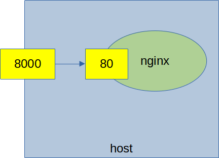
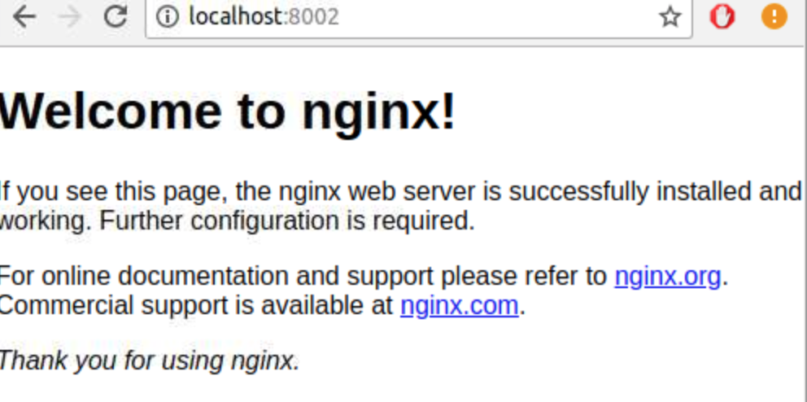
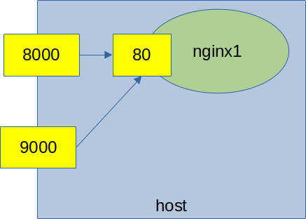
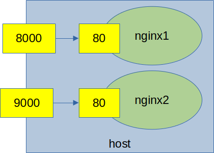

<link rel='stylesheet' href='../assets/css/main.css'/>

# Lab: Port Mapping

## Overview

So, we have had fun executing linux commands on our container.   How do we do networking on our container?  Networking is
going to be picked up by our host.  So, we need to specify what ports we want forwarded to the container

Here's how we do port forwarding.

```bash
$   docker container run -p HOSTPORT:CONTAINERPORT
```

## Step-1: Run nginx

```bash
$   docker run -d --name nginx --rm nginx
$   docker ps
```

We can see nginx container is running.  But there is no way to get to it!

Stop the container

```bash
$   docker stop nginx
```

## Step 2: Run with Port Mapping

We run this, we are going to map port 8000 on the host is pointed to port 80 on the container



On Terminal-1

```bash
$   docker run --rm --name nginx1 -p 8000:80 nginx
```

Leave this terminal running...

From terminal-2

See the port forward information in `docker ps`

```bash
$   docker ps
```

From terminal-2, access port 8000

```bash
$   curl localhost:8000/
```

On the first terminal-1, you will see log like that:

```console
10.10.0.1 - - [10/Sep/2021:19:30:34 +0000] "GET / HTTP/1.1" 200 612 "-" "curl/7.71.1" "-"
```

If you have a browser environment, try going to the following url :  `http://localhost:8000/`

You should see the nginx welcome page

<p></p>

## Step 3: Stop the container

Press Cntrl-C to stop the container.

Now, try going back to the browser and re-loading. Do you see the page?

The page doesn't work while the contianer is stopped!

## Step 4: Run the container in the background

```bash
$   docker container run --rm -p 8000:80 -d nginx
```

You will see the new container id copied to the screen, as this runs in the background

```console
ffcee5395fc4fc4ca97c48b03b3510ec973c6fa8601e9b299e306a6d36f6ff74
```

## Step 5: Go back to the page

As in step 2, go back to the page.  You should see nginx running again.

## Step 6:  Stop the container

```bash
$   docker stop <paste-container-id-here>
```

It sohould stop your container. If it does not recognize the container id you pasted, say "docker ps" to get the list of container ids.

## Step-7: Forward Multiple Ports to Nginx



```bash
$   docker run --rm -d -p 8000:80 -p 9000:80 nginx
```

Use `docker ps` to see ports being forwarded

```bash
$   docker ps
```

```console
56ab467ef778   nginx       "/docker-entrypoint.…"   4 seconds ago   Up 3 seconds   0.0.0.0:8000->80/tcp, 0.0.0.0:9000->80/tcp, :::8000->80/tcp, :::9000->80/tcp               kind_diffie
```

Try accessing the page on both 8000 and 9000

```bash
$   curl localhost:8000/
$   curl localhost:9000/
```

You will see the page on both pages

## Bonus Lab: Run 2 containers

In this lab, start 2 ngin containers, one listening on port 8000 and another listening on port 9000.

Check both are working using `curl`


