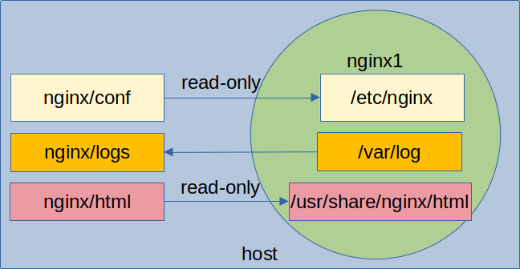

<link rel='stylesheet' href='../assets/css/main.css'/>

# Lab: Shared data use case: Nginx

## Overview

Running nginx with shared directories

Here is our scheme



**nginx config**

- on host, located at `nginx/conf/nginx.conf`
- within container it is mounted at `/etc/nginx/nginx.conf`
- read-only

**nginx logs folder**

- on host, located at `nginx/logs`
- within container it is mounted at `/var/log/nginx`
- read-write

**nginx default welcome page**

- on host : `nginx/html/`
- on container : `/usr/share/ngin/html/`
- read-only

## Step-1: Launch Nginx

```bash

# be in the storage/nginx dir
$   cd ~/docker-labs/storage/nginx

$   docker run -d -p 8000:80 \
               -v $(pwd)/nginx/conf/nginx.conf:/etc/nginx/nginx.conf:ro \
               -v $(pwd)/nginx/logs:/var/logs/nginx \
               -v $(pwd)/nginx/html:/usr/share/nginx/html \
               nginx
```

Verify by:

```bash
$   docker ps
```

## Step-2: Access nginx

```bash
$ curl  localhost:8000/
```

You will see

```console
<html>
        <head>
        <title>Welcome to MY nginx</title>
        </head>

        <body>
                Welcome to MY ngin
        </body>
</html>
```

## Step-3: Modify the html page

- Edit file `nginx/html/index.html`
- Make some changes

Now when you access the file, you will see your changes:

```bash
$   curl   localhost:8000/
```

Notice the changes are reflected live, no need to restart the container

## Step-4: Stop the container

```bash
# substitute container_id accordingly
$   docker stop container_id
```
