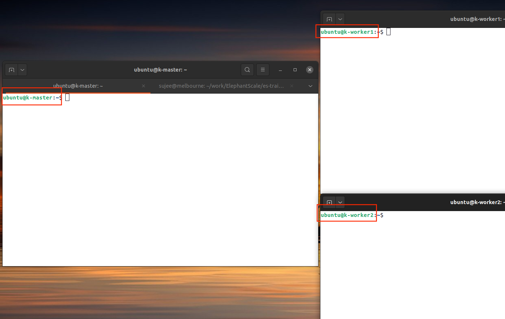

<link rel='stylesheet' href='../assets/css/main.css'/>

# Lab : Docker Swarm Intro

## Overview

We will see how to use **docker swarm** feature to launch services in distributed mode

## Duration

20 minutes

## Step-1: Login to nodes

For this lab, we will need 3 nodes (1 master + 2 workers)

Instructor will provide machine details and login information

Go ahead and login to all 3 machines



(right click on the image to see larger version)

## Step-2: Set Hostnames

We want to make sure we have unique hostnames, so they are easy to identify.

**on master**

```bash
$  sudo hostnamectl set-hostname master

# verify by
$   hostname
```

**on worker1**

```bash
$  sudo hostnamectl set-hostname worker1

# verify by
$   hostname
```

**on worker2**

```bash
$  sudo hostnamectl set-hostname worker2

# verify by
$   hostname
```

When you set the hostname, the terminal prompt will not change.  You need to log out and log back in

## Step-3: Initialize Swarm on Master

**on master node**

```bash
$   docker swarm init
```

You will see output like

```console
Swarm initialized: current node (2ty7dlvkqcrzkzzxayoo7wge9) is now a manager.

To add a worker to this swarm, run the following command:

    docker swarm join --token SWMTKN-1-0bl2pi6uzbp7yxi0igvrwj4d3lsom62xabtup1nbuplubx5kg2-agnl29ginc7pebzmyxkalitcr 172.16.0.83:2377

To add a manager to this swarm, run 'docker swarm join-token manager' and follow the instructions
```

**ACTION: Coyp and save the 'join' command printed on the console**

**ACTION: Check the status of swarm**

```bash
$   docker node ls
```

```console
ID                            HOSTNAME   STATUS    AVAILABILITY   MANAGER STATUS   ENGINE VERSION
2ty7dlvkqcrzkzzxayoo7wge9 *   k-master   Ready     Active         Leader           20.10.8
```

Good master is online!

## Step-4: Join workers to swarm

Execute the join command on workers

**On worker1 and worker2**

```bash
# Run ths swarm join command printed for you...
$   docker swarm join ...
```

You will see output like

```console
This node joined a swarm as a worker.
```

**on master**

Check swarm status

```bash
$   docker node ls
```

You should see 3 nodes!

```console
ID                            HOSTNAME    STATUS    AVAILABILITY   MANAGER STATUS   ENGINE VERSION
2ty7dlvkqcrzkzzxayoo7wge9 *   k-master    Ready     Active         Leader           20.10.8
q0nioez0n6kusspwvkmeho8jx     k-worker1   Ready     Active                          20.10.8
6mtgv125bvk3wocyuklrzl1ep     k-worker2   Ready     Active                          20.10.8
```

**Note**

If you run into problems joining nodes to the swarm, you can have the problematic node leave the cluster with the command below.

```bash
$   docker swarm leave
```

## Step-5: Run a hello-world service

**on master**

```bash
$   docker service create --replicas 1 --name helloworld alpine ping docker.com
```

## Step-6: Inspect the service

```bash
$   docker service ls
```

```console
ID             NAME         MODE         REPLICAS   IMAGE           PORTS
t051ngtkgaaw   helloworld   replicated   1/1        alpine:latest   
```

Inspect the service

```bash
$   docker service inspect --pretty helloworld

# to get json output, skip --pretty
$    docker service inspect helloworld
```
You will see output similar to 

```console
ID:		t051ngtkgaawe1sdxf1w1s367
Name:		helloworld
Service Mode:	Replicated
 Replicas:	1
Placement:
UpdateConfig:
 Parallelism:	1
 On failure:	pause
 Monitoring Period: 5s
 Max failure ratio: 0
 Update order:      stop-first
RollbackConfig:
 Parallelism:	1
 On failure:	pause
 Monitoring Period: 5s
 Max failure ratio: 0
 Rollback order:    stop-first
ContainerSpec:
 Image:		alpine:latest@sha256:e1c082e3d3c45cccac829840a25941e679c25d438cc8412c2fa221cf1a824e6a
 Args:		ping docker.com 
 Init:		false
Resources:
Endpoint Mode:	vip
```

See process

```bash
$   docker service ps helloworld
```

```console
D             NAME           IMAGE           NODE        DESIRED STATE   CURRENT STATE           ERROR     PORTS
8kz17yta0kh2   helloworld.1   alpine:latest   k-worker1   Running         Running 4 minutes ago             
```

**on the worker node**

Login to which ever node the service is running, and see docker processes

```bash
$   docker ps
```

You will see the container running

```console
2ead14bec53b   alpine:latest          "ping docker.com"        4 minutes ago   Up 4 minutes             helloworld.1.8kz17yta0kh24k4fgc80v7g0b
```

## Step-7: Scale the service

**on master**

```bash
$   docker service scale helloworld=5
```

you will see output

```console
helloworld scaled to 5
overall progress: 5 out of 5 tasks 
1/5: running   [==================================================>] 
2/5: running   [==================================================>] 
3/5: running   [==================================================>] 
4/5: running   [==================================================>] 
5/5: running   [==================================================>] 
verify: Service converged 
```

```bash
$   docker service ls
```

```console
ID             NAME         MODE         REPLICAS   IMAGE           PORTS
t051ngtkgaaw   helloworld   replicated   5/5        alpine:latest   
```

```bash
$   docker service ps helloworld
```

We see multiple instances running on worker nodes!

```console
ID             NAME           IMAGE           NODE        DESIRED STATE   CURRENT STATE                ERROR     PORTS
8kz17yta0kh2   helloworld.1   alpine:latest   k-worker1   Running         Running 9 minutes ago                  
nnrqw85cr26c   helloworld.2   alpine:latest   k-master    Running         Running about a minute ago             
ybb4hzsgfb6e   helloworld.3   alpine:latest   k-master    Running         Running about a minute ago             
nknac3akw8q6   helloworld.4   alpine:latest   k-worker1   Running         Running about a minute ago             
y842561lmzow   helloworld.5   alpine:latest   k-worker2   Running         Running about a minute ago             
```

## Step-8: Service logs

Let's see what's happening with our service

```bash
$   docker service logs helloworld
```

```console
helloworld.2.nnrqw85cr26c@k-master    | PING docker.com (52.6.16.15): 56 data bytes
helloworld.3.ybb4hzsgfb6e@k-master    | PING docker.com (3.90.54.51): 56 data bytes
helloworld.5.y842561lmzow@k-worker2    | PING docker.com (3.225.66.59): 56 data bytes
helloworld.1.8kz17yta0kh2@k-worker1    | PING docker.com (3.90.54.51): 56 data bytes
helloworld.4.nknac3akw8q6@k-worker1    | PING docker.com (3.90.54.51): 56 data bytes
```

## Step-9: Delete service

```bash
$   docker service rm helloworld
```


## Step-10: Let's try another service - nginx

**on master**

```bash
$   docker service create \
            --replicas 4 \
            --name nginx \
            --publish 8000:80 \
            nginx
```

Open another terminal, and type this command

```bash
$   docker service ls
```

You might see an output like this:

```console
ID             NAME      MODE         REPLICAS   IMAGE          PORTS
xmzm8wr8ve27   nginx     replicated   4/4        nginx:latest   *:8000->80/tcp
```

Look at service status

```bash
$   docker service ps nginx
```

```console
ID             NAME      IMAGE          NODE        DESIRED STATE   CURRENT STATE                ERROR     PORTS
v9t6juf7v0n9   nginx.1   nginx:latest   k-worker2   Running         Running 2 minutes ago                  
b5dv8csxrqxy   nginx.2   nginx:latest   k-master    Running         Running about a minute ago             
dy3wvdf1cj75   nginx.3   nginx:latest   k-worker1   Running         Running 2 minutes ago                  
flr232k7l3xt   nginx.4   nginx:latest   k-worker2   Running         Running 2 minutes ago                  
```

Access the service

```bash
$   curl localhost:8000/
```

You will see nginx welcome page

Remove the service

```bash
$   docker service rm nginx
```

## References

- https://docs.docker.com/engine/swarm/swarm-tutorial/
- https://upcloud.com/community/tutorials/docker-swarm-orchestration/

